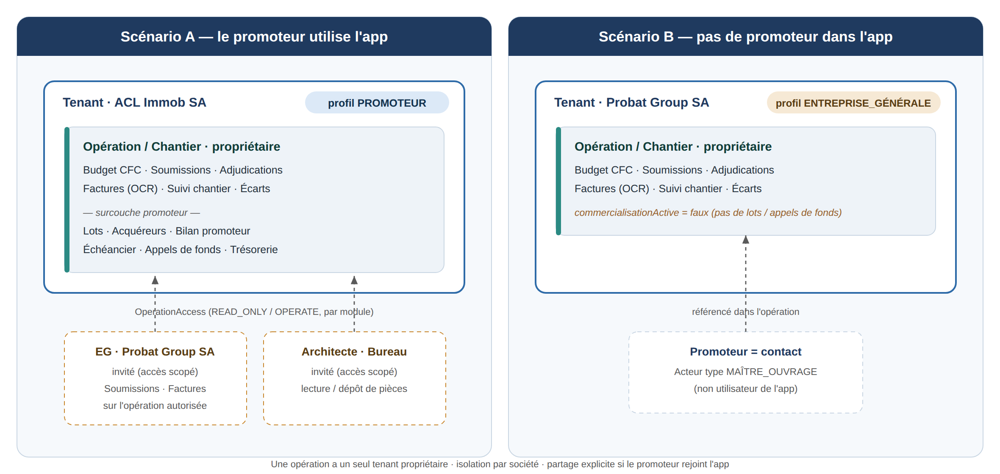

**PLAN DE PROJET**

**Plateforme SaaS multi-tenant**

**de gestion de promotions immobilières**

*Du foncier à la livraison — budget CFC, soumissions, adjudications,*

*suivi de chantier, facturation et appels de fonds acquéreurs*

**Plan produit / fonctionnel · Architecture technique · Roadmap**

Marché cible : Suisse romande

Version 1.0 — 12 août 2026

*Document de travail — préparé pour Christophe*

**Sommaire**

**1. Résumé exécutif** **3**

**2. Contexte et problème métier** **4**

> 2.1 Le déroulement d’une promotion immobilière en Suisse 4
>
> 2.2 Les points de douleur actuels 4
>
> 2.3 Le rôle structurant du CFC 4

**3. Vision produit, marché et concurrence** **6**

> 3.1 Vision 6
>
> 3.2 Utilisateurs et rôles 6
>
> 3.3 Paysage concurrentiel 6

**4. Modèle métier et processus complet** **7**

> 4.1 La hiérarchie des objets (multi-tenant) 7
>
> 4.2 Vue d’ensemble du processus 7
>
> 4.3 Le détail des coûts, étape par étape 9
>
> 4.4 Soumissions, adjudications et lecture des factures 9
>
> 4.5 Le budget / bilan promoteur (le fil financier) 10

**5. Plan produit / fonctionnel** **11**

> 5.1 Le fil rouge : de l’achat du terrain à la livraison 11
>
> 5.2 Cartographie des modules 11
>
> 5.3 Détail des modules du cœur métier 13
>
> 5.4 Découpage MVP / V2 / V3 15
>
> 5.5 Modèle de données détaillé 16
>
> 5.6 Profils clients et modularité (promoteur, EG, architecte) 19

**6. Passerelle avec Kolabimo** **20**

> 6.1 Répartition des rôles (source de vérité) 20
>
> 6.2 Correspondance des données 20
>
> 6.3 Le déclencheur : fin d’étape → appels de fonds 21
>
> 6.4 Réutilisation de l’existant et compléments 21
>
> 6.5 Spécification technique de la passerelle 22

**7. Architecture technique multi-tenant** **24**

> 7.1 Principes directeurs 24
>
> 7.2 Stratégie d’isolation multi-tenant 24
>
> 7.3 Stack technique proposée 24
>
> 7.4 Sécurité, conformité et audit 25
>
> 7.5 Intégrations cibles 25

**8. Plan projet et roadmap** **26**

> 8.1 Approche 26
>
> 8.2 Phases et jalons 26
>
> 8.3 Équipe recommandée 26
>
> 8.4 Ordres de grandeur budgétaires 26
>
> 8.5 Risques et parades 28
>
> 8.6 Prochaines étapes concrètes 28

**9. Prototype et maquettes (Prometis)** **29**

> 9.1 Inventaire des écrans 29
>
> 9.2 Cohérence prototype ↔ modèle 29

**Annexe — Sources et références** **31**

**1. Résumé exécutif**

Ce document présente le plan d’un logiciel en mode SaaS (Software as a Service) multi-tenant destiné aux promoteurs immobiliers de Suisse romande. L’objectif est de couvrir, dans un outil unique et intégré, l’ensemble du cycle de vie d’une promotion : de l’acquisition du terrain jusqu’à la livraison des lots aux acquéreurs finaux, en passant par la construction du budget selon le Code des frais de construction (CFC), les appels d’offres (soumissions), les adjudications, le suivi des travaux et des factures, et la gestion des appels de fonds facturés aux acheteurs de villas ou d’appartements.

La proposition de valeur tient en une phrase : **remplacer le patchwork actuel (tableurs Excel, logiciels de métré, comptabilité, e-mails et classeurs papier) par une source de vérité unique** qui relie en permanence le budget prévisionnel, les offres reçues, les contrats adjugés, les factures des entreprises et les encaissements des acquéreurs — le tout structuré par la nomenclature CFC et par lot.

**Ce qui distingue le projet**

- **Ancrage suisse romand :** CFC/CRB, phases SIA, norme SIA 118 pour les contrats d’entreprise, PPE, cédules hypothécaires, droits de mutation cantonaux et conformité à la nLPD — là où l’essentiel des solutions du marché sont pensées pour la VEFA française.

- **Le fil rouge budget → soumission → adjudication → facture :** la comparaison permanente entre ce qui était budgété, ce qui a été offert, ce qui a été commandé et ce qui est facturé, poste CFC par poste CFC.

- **Double vue financière :** les dépenses (factures entreprises) et les recettes (appels de fonds acquéreurs par numéro de lot) réconciliées dans un même tableau de trésorerie par opération.

- **Lecture automatique des factures (OCR/IA, dès le MVP) :** chaque facture de corps de métier est lue, classée dans le bon CFC et rapprochée du budget et de l’adjudication, sans double saisie.

<table>
<colgroup>
<col style="width: 100%" />
</colgroup>
<tbody>
<tr class="odd">
<td>
<strong>En bref</strong>

• Cible : promoteurs, maîtres d’ouvrage et régies de développement de Suisse romande (VD, GE, VS, FR, NE, JU).

• Modèle : SaaS multi-tenant, abonnement par société promotrice, tarification par opération/volume ou par utilisateur.

• MVP visé en 5 à 7 mois : foncier, budget CFC, soumissions/adjudications, factures, appels de fonds, reporting.

• Hébergement des données en Suisse (conformité nLPD), architecture pensée pour une extension multilingue (DE/IT) ultérieure.
</td>
</tr>
</tbody>
</table>

**2. Contexte et problème métier**

**2.1 Le déroulement d’une promotion immobilière en Suisse**

Une opération de promotion immobilière est un projet long (souvent 3 à 6 ans), fortement capitalistique et jalonné d’étapes réglementées. En Suisse, son déroulement suit largement le modèle de prestations et d’honoraires de la SIA (règlement SIA 112), qui découpe le projet en six phases. Le logiciel doit épouser ce découpage, car c’est le langage commun des architectes, ingénieurs, entreprises et maîtres d’ouvrage.

| **Phase SIA** | **Intitulé**                                         | **Ce que l’outil doit gérer**                                                                 |
|---------------|------------------------------------------------------|-----------------------------------------------------------------------------------------------|
| Phase 1       | Définition des objectifs (étude stratégique)         | Fiche opération, faisabilité économique, recherche et sécurisation du foncier.                |
| Phase 2       | Études préliminaires (faisabilité)                   | Énoncé des besoins, étude de faisabilité, bilan prévisionnel initial, plan de financement.    |
| Phase 3       | Étude du projet (avant-projet, projet, autorisation) | Budget CFC détaillé, dépôt de la demande d’autorisation de construire, mise à jour du bilan.  |
| Phase 4       | Appels d’offres                                      | Soumissions par lot CFC, réception et comparaison des offres, tableau d’adjudication.         |
| Phase 5       | Réalisation (exécution, mise en service)             | Contrats SIA 118, suivi de chantier, situations et factures, avenants, réception, garanties.  |
| Phase 6       | Exploitation                                         | Levée des réserves, garanties (2 ans / 5 ans), décomptes finaux, remise aux acquéreurs / PPE. |

**2.2 Les points de douleur actuels**

Aujourd’hui, un promoteur pilote typiquement son opération avec un tableur Excel « bilan promoteur », un logiciel de métré/soumissions (type Messerli, Baubit, Bonus), un logiciel de comptabilité (Abacus, Bexio, Banana), des échanges par e-mail avec les entreprises et le notaire, et des classeurs pour les appels de fonds. Il en résulte :

- Une double, voire triple saisie des mêmes montants (budget, offre, commande, facture), source d’erreurs et de perte de temps.

- Une absence de vue consolidée en temps réel du « reste à engager » et du « reste à dépenser » par poste CFC.

- Une réconciliation manuelle et laborieuse entre les factures des entreprises (dépenses) et les appels de fonds encaissés auprès des acquéreurs (recettes).

- Un suivi des soumissions et adjudications éclaté entre e-mails et tableurs, difficile à auditer.

- Un manque de traçabilité et de reporting pour les associés, les banques finançant l’opération et les investisseurs.

**2.3 Le rôle structurant du CFC**

Le **Code des frais de construction (CFC)**, édité par le CRB (Centre suisse d’études pour la rationalisation de la construction), est la colonne vertébrale financière de tout le projet. Il structure les coûts en une arborescence de 0 à 9 qui sert simultanément de trame au budget, aux soumissions et à la comptabilité analytique — c’est ce qui permet de comparer « les mêmes postes » entre le prévu, l’offert et le facturé.

| **CFC** | **Groupe principal**                   | **Exemples de sous-groupes / contenu**                                                                                                         |
|---------|----------------------------------------|------------------------------------------------------------------------------------------------------------------------------------------------|
| 0       | Terrain                                | Prix d’achat, droits de mutation, frais de notaire, taxes, géomètre.                                                                           |
| 1       | Travaux préparatoires                  | Démolitions, déblaiement, protections, installations de chantier communes.                                                                     |
| **2**   | **Bâtiment (≈ 30–40 % du budget)**     | 21 Gros œuvre 1 · 22 Gros œuvre 2 · 23 Électricité · 24 CVC · 25 Sanitaire · 27 Aménagements intérieurs 1 · 28 Aménagements 2 · 29 Honoraires. |
| 3       | Équipements d’exploitation (≈ 20–30 %) | Ascenseurs, équipements techniques spécifiques.                                                                                                |
| 4       | Aménagements extérieurs                | Terrassements extérieurs, jardins, clôtures, places de parc extérieures.                                                                       |
| 5       | Frais secondaires et compte d’attente  | Autorisations, taxes, assurances, intérêts intercalaires, frais de financement, échantillons.                                                  |
| 9       | Ameublement et décoration              | Mobilier, signalétique, décoration.                                                                                                            |

L’arborescence descend jusqu’à un grand niveau de détail : par exemple 2 (Bâtiment) → 27 (Aménagements intérieurs 1) → 271 (Plâtrerie) → 271.0 (Crépis et enduits intérieurs). Le logiciel doit gérer cette hiérarchie à N niveaux, paramétrable, et permettre de basculer entre le CFC « à 2 positions » (pilotage) et le CFC détaillé (soumissions).

**3. Vision produit, marché et concurrence**

**3.1 Vision**

**« Le poste de pilotage unique du promoteur romand. »** Un espace où chaque opération vit du terrain à la livraison, où chaque franc budgété se retrouve dans une offre, une commande, une facture et un appel de fonds, et où le promoteur sait à tout instant où il en est : engagé, dépensé, encaissé, marge prévisionnelle.

**3.2 Utilisateurs et rôles**

| **Rôle**                      | **Besoins principaux**                                                                                          |
|-------------------------------|-----------------------------------------------------------------------------------------------------------------|
| Promoteur / Direction         | Vue portefeuille d’opérations, marge et trésorerie prévisionnelles, alertes de dépassement, reporting bancaire. |
| Chef de projet / Développeur  | Budget CFC, lancement des soumissions, adjudications, suivi de chantier, avenants.                              |
| Économiste de la construction | Comparaison des offres, décompte des métrés, contrôle des situations et factures.                               |
| Comptabilité / Finance        | Rapprochement factures/paiements, TVA, appels de fonds, exports comptables, trésorerie.                         |
| Commercialisation / Vente     | Suivi des lots (PPE), réservations, acquéreurs, échéancier des appels de fonds.                                 |
| Acquéreur final (portail)     | Suivi de son lot, avancement, appels de fonds reçus, documents, choix des finitions (TMA).                      |
| Intervenants externes         | Architecte, ingénieurs, entreprises, notaire, banque : accès restreint en lecture/dépôt de documents.           |

**3.3 Paysage concurrentiel**

Le marché des logiciels de promotion immobilière est dominé par des acteurs orientés VEFA française (Scoplan, Pegao, Promoges/LAE Ingénierie, Aprilyos, Fefa). Ils gèrent bien la commercialisation, les appels de fonds VEFA et le SAV, mais reposent sur une logique juridique et fiscale française (échéancier VEFA réglementé, garantie financière d’achèvement) qui ne correspond pas au cadre suisse. En Suisse, les promoteurs assemblent des outils spécialisés : métré/soumissions (Messerli, Baubit, Bonus/Sépia), comptabilité (Abacus, Bexio, Banana), et tableurs pour le bilan promoteur.

<table>
<colgroup>
<col style="width: 100%" />
</colgroup>
<tbody>
<tr class="odd">
<td>
<strong>L’opportunité</strong>

Il n’existe pas d’acteur dominant proposant, pour la Suisse romande, une plateforme intégrée qui relie le budget CFC, les soumissions/adjudications SIA, le suivi des factures ET les appels de fonds acquéreurs par lot.

Le positionnement gagnant : « le fil rouge financier CFC de bout en bout », plutôt qu’un énième CRM de vente ou un énième logiciel de métré.
</td>
</tr>
</tbody>
</table>

| **Catégorie**            | **Ce qu’ils font bien**                                          | **Ce qui manque pour le promoteur romand**                                              |
|--------------------------|------------------------------------------------------------------|-----------------------------------------------------------------------------------------|
| Suites VEFA (FR)         | Commercialisation, appels de fonds VEFA, SAV, portail acquéreur. | Cadre juridique/fiscal FR ; pas de CFC ni de SIA 118 ; pas de bilan promoteur suisse.   |
| Métré / soumissions (CH) | Descriptifs CAN/NPK, métrés, comparaison d’offres, CFC.          | Pas de gestion des ventes, des appels de fonds ni de la trésorerie d’opération.         |
| Comptabilité (CH)        | Écritures, TVA, ISO 20022, salaires.                             | Pas de logique projet/CFC ni de rapprochement budget-offre-facture.                     |
| Tableurs Excel           | Souplesse, coût nul, bilan promoteur sur mesure.                 | Pas de collaboration, pas de piste d’audit, erreurs, aucune consolidation portefeuille. |

**4. Modèle métier et processus complet**

Cette section décrit précisément « ce que le logiciel doit modéliser » : d’une part la hiérarchie des objets (de la société promotrice jusqu’au lot vendable), d’autre part le processus réel d’une promotion, du montage financier à la facture classée par CFC. Le fil conducteur retenu est l’immeuble en PPE (propriété par étages), cas le plus complet, mais le modèle couvre aussi villas, lotissements et chalets.

**4.1 La hiérarchie des objets (multi-tenant)**

Chaque promoteur crée son compte et sa société : celle-ci est le « tenant », la racine qui isole toutes ses données des autres clients. À l’intérieur, il crée des promotions, qui contiennent des biens de natures variées, eux-mêmes déclinés en lots vendables.

| **Niveau**  | **Objet**           | **Contenu et attributs principaux**                                                                                                                                                                |
|-------------|---------------------|----------------------------------------------------------------------------------------------------------------------------------------------------------------------------------------------------|
| **Tenant**  | Société promotrice  | Raison sociale, adresse, logo, n° IDE / TVA, actionnaires, employés, utilisateurs et rôles (permissions). Racine de l’isolation des données.                                                       |
| **Projet**  | Promotion           | Nom, commune, parcelle(s), phase SIA, équipe (architecte, ingénieurs), budget, plan de financement, bilan promoteur.                                                                               |
| **Ouvrage** | Bien                | Nature : lotissement · villa · immeuble · chalet. Un immeuble contient des appartements. Une promotion peut mélanger plusieurs natures.                                                            |
| Composant   | Appartement / unité | Pour un immeuble : étage, nombre de pièces, surface, quote-part PPE, cave.                                                                                                                         |
| Rattaché    | Parking             | Rattaché à l’appartement, avec un type : box, place intérieure, place couverte, place extérieure — chacun avec son prix.                                                                           |
| **Vente**   | Lot                 | Unité vendable : n° de lot, quote-part PPE, prix de vente, statut (disponible / réservé / vendu / acté), acquéreur, échéancier d’appels de fonds. Prix total acte = prix appartement + Σ parkings. |

<table>
<colgroup>
<col style="width: 100%" />
</colgroup>
<tbody>
<tr class="odd">
<td>
<strong>Illustration — immeuble PPE</strong>

Société « Bonjour Promotions SA » → Promotion « Les Jardins de Prilly »

→ Immeuble A → 12 appartements → 12 lots PPE (quote-parts) + parkings + caves

→ Immeuble B → 8 appartements → 8 lots PPE

Chaque appartement = un lot avec sa quote-part, son prix et son échéancier d’appels de fonds propre.
</td>
</tr>
</tbody>
</table>

**4.2 Vue d’ensemble du processus**

Le processus se lit en neuf grandes étapes. La colonne CFC indique le rattachement comptable, ce qui permet de comparer en permanence le prévu, l’adjugé et le facturé.

| **\#** | **Étape**                     | **Ce qui se passe**                                                                             | **CFC concerné** |
|--------|-------------------------------|-------------------------------------------------------------------------------------------------|------------------|
| 1      | Montage & budget prévisionnel | Construction du bilan promoteur (coûts vs recettes) et du gain potentiel avant tout engagement. | Tous (0 à 5)     |
| 2      | Acquisition du terrain        | Achat du terrain (avec ou sans bâtiment existant), acte notarié, frais et droits de mutation.   | CFC 0            |
| 3      | Préparation & viabilisation   | Démolition de l’existant, désamiantage, terrassement, raccordements et leurs taxes.             | CFC 1            |
| 4      | Études & autorisations        | Honoraires architecte / ingénieurs, permis de construire, taxes et plus-value.                  | CFC 29 / 5       |
| 5      | Construction                  | Gros œuvre, second œuvre, technique, abri PC (ou contribution), équipements, extérieurs.        | CFC 2 / 3 / 4    |
| 6      | Soumissions & adjudications   | Consultation des entreprises par corps de métier, offres, comparaison, adjudication.            | Par CFC          |
| 7      | Facturation & suivi           | Factures de chaque corps de métier lues et classées automatiquement (OCR/IA) dans le bon CFC.   | Par CFC          |
| 8      | Ventes & appels de fonds      | Réservations, actes, appels de fonds échelonnés par lot selon l’avancement.                     | Recettes / lot   |
| 9      | Livraison & clôture           | Réception, levée des réserves, décompte final, garanties, remise aux acquéreurs / PPE.          | Clôture          |

**4.3 Le détail des coûts, étape par étape**

Cette décomposition sert de trame au budget et couvre les spécificités suisses qui n’existent pas dans les solutions étrangères.

**Acquisition foncière — CFC 0**

- Prix du terrain, avec ou sans bâtiment existant ; conditions et date de l’acte.

- Frais de notaire, droits de mutation (barème cantonal), émoluments du registre foncier, frais de cédule hypothécaire, géomètre.

**Préparation & viabilisation — CFC 1**

- Démolition du bâtiment existant, désamiantage / dépollution, évacuation, terrassement.

**Raccordements** (eau, électricité, gaz, égouts / assainissement, télécom / fibre) et leurs **taxes de raccordement et d’équipement** communales, qui varient d’une commune à l’autre.

**Taxes et contributions publiques — CFC 5**

- Taxe d’équipement, émoluments du permis de construire, taxes diverses.

**Taxe sur la plus-value (art. 5 LAT) :** prélèvement dû lors du classement en zone à bâtir ou d’une augmentation de valeur ; à budgéter selon le canton/commune.

**Abri de protection civile (PC) — spécificité suisse**

Pour un immeuble, la loi impose généralement de **construire un abri privé** (nombre de places protégées selon les logements/pièces et le canton) **ou, en cas de dispense, de verser une contribution de remplacement.** L’application doit permettre de choisir l’option (construire vs contribution) et de la budgéter au bon poste CFC.

**Construction — CFC 2, 3 et 4**

- Honoraires : architecte et ingénieurs (civil, CVSE, géotechnique) — CFC 29.

- Gros œuvre 1 et 2 (CFC 21-22), installations électriques (23), CVC (24), sanitaire (25), aménagements intérieurs (27-28).

- Équipements d’exploitation — ascenseurs, etc. (CFC 3) ; aménagements extérieurs, jardins, parkings (CFC 4).

**Frais secondaires et de vente — CFC 5 et commercialisation**

- Assurances de construction, intérêts intercalaires du crédit de construction, frais bancaires.

- Commercialisation / courtage, frais de notaire des ventes, publicité.

**4.4 Soumissions, adjudications et lecture des factures**

Sur le volet dépenses, l’app trace tout le cycle depuis la consultation jusqu’à la facture, sans entrer dans le détail des métrés (que gèrent les logiciels de soumission spécialisés).

**Soumissions :** pour chaque poste CFC / corps de métier, l’app enregistre à qui la soumission a été envoyée (par exemple les entreprises de peinture A, B et C), qui a répondu et à quel prix, avec les dates — de quoi produire un tableau comparatif clair.

**Adjudication :** choix de l’entreprise retenue ; le montant adjugé se reporte automatiquement sur la ligne CFC (colonne « adjugé ») et génère le contrat / bon de commande.

**Factures avec lecture automatique (OCR/IA — dès le MVP) :** à réception, l’app lit la facture, en extrait le fournisseur, le numéro, la date, les montants HT/TVA et les références, puis **propose automatiquement le bon poste CFC** et rapproche la facture du contrat adjugé et du budget. Un contrôleur valide (validation humaine conservée), et l’app alerte en cas de dépassement. Le modèle s’améliore par fournisseur et par CFC.

<table>
<colgroup>
<col style="width: 100%" />
</colgroup>
<tbody>
<tr class="odd">
<td>
<strong>Différenciateur clé</strong>

Le classement automatique des factures dans le bon CFC (lecture OCR/IA dès le MVP) supprime la double saisie et alimente en temps réel la comparaison budget → adjugé → facturé.

La validation humaine est maintenue pour garantir la fiabilité comptable et la piste d’audit.
</td>
</tr>
</tbody>
</table>

**4.5 Le budget / bilan promoteur (le fil financier)**

En amont de tout, l’application aide à bâtir le bilan promoteur : la somme des coûts (terrain + préparation + construction + abri/contribution + taxes + frais secondaires + frais de vente) face à la somme des recettes (prix de vente des lots), pour faire ressortir la marge et le rendement prévisionnels — le « gain potentiel ». Ce bilan devient la référence, comparée en continu au réalisé (adjugé puis facturé) grâce à la vue d’écart par CFC décrite plus loin.

**5. Plan produit / fonctionnel**

**5.1 Le fil rouge : de l’achat du terrain à la livraison**

Le cœur fonctionnel du produit est un enchaînement d’objets métier qui se transmettent la valeur, tous rattachés à une opération et rattachables à un poste CFC et à un lot :

1.  **Opération / Terrain —** création de l’opération, acquisition foncière (prix, frais de notaire, droits de mutation cantonaux), plan de financement.

2.  **Budget CFC initial —** construction du budget prévisionnel par poste CFC, avec réserves et provisions ; c’est la référence contre laquelle tout sera comparé.

3.  **Soumissions (appels d’offres) —** pour chaque poste CFC, préparation du dossier, consultation des entreprises, réception des offres.

4.  **Comparaison et adjudication —** tableau comparatif des offres, analyse, proposition d’adjudication, décision, contrat SIA 118.

5.  **Suivi des travaux et factures —** situations mensuelles, factures des entreprises, avenants, validation, imputation CFC.

6.  **Appels de fonds acquéreurs —** facturation des acomptes aux acheteurs selon l’avancement, par numéro de lot, suivi des encaissements.

7.  **Trésorerie et clôture —** réconciliation dépenses/recettes, marge, décompte final, garanties, livraison.

<table>
<colgroup>
<col style="width: 100%" />
</colgroup>
<tbody>
<tr class="odd">
<td>
<strong>La règle d’or du produit</strong>

À chaque étape, le montant est comparé à l’étape précédente, au même niveau CFC :

Budgété → Offert (adjugé) → Commandé (contrat + avenants) → Facturé → Payé.

Cet « écart permanent » par poste CFC est la fonctionnalité signature du logiciel.
</td>
</tr>
</tbody>
</table>

**5.2 Cartographie des modules**

Le produit s’organise en modules cohérents. La colonne « Priorité » indique le rattachement à une version (M = MVP, 2 = version 2, 3 = version 3).

| **\#** | **Module**                    | **Fonctions clés**                                                                                                                                       | **Prio.** |
|--------|-------------------------------|----------------------------------------------------------------------------------------------------------------------------------------------------------|-----------|
| A      | Opérations & foncier          | Fiche opération, acquisition terrain, frais notaire, droits de mutation, plan de financement, bilan promoteur.                                           | **M**     |
| B      | Budget CFC                    | Arborescence CFC paramétrable, budget par poste, réserves, versions/révisions, indexation.                                                               | **M**     |
| C      | Soumissions / appels d’offres | Dossiers de consultation, liste des entreprises, envoi, réception, questions/réponses.                                                                   | **M**     |
| D      | Comparaison & adjudication    | Tableau comparatif des offres, analyse, proposition, décision, bons de commande / contrats.                                                              | **M**     |
| E      | Contrats & SIA 118            | Contrats d’entreprise, conditions SIA 118, garanties, retenues, avenants, décompte final.                                                                | **M**     |
| F      | Suivi travaux & factures      | Situations, factures, lecture automatique OCR/IA + proposition du CFC, validation multi-niveaux, planning simplifié.                                     | **M**     |
| G      | Écart budget-offre-facture    | Vue consolidée engagé/dépensé/reste à faire par CFC, alertes de dépassement.                                                                             | **M**     |
| H      | Lots & acquéreurs             | Tableau des lots (PPE), réservations, acquéreurs, actes notariés, plan de vente.                                                                         | **M**     |
| I      | Appels de fonds               | Échéanciers par lot, génération et envoi des appels, suivi des encaissements, relances.                                                                  | **M**     |
| J      | Trésorerie & reporting        | Cash-flow opération, marge prévisionnelle, tableaux de bord, reporting bancaire.                                                                         | **M**     |
| K      | GED & documents               | Bibliothèque documentaire par opération/lot/CFC, versions, partage externe.                                                                              | 2         |
| L      | Portail acquéreur             | Suivi d’avancement, documents, appels de fonds, choix de finitions (TMA), SAV.                                                                           | 2         |
| M      | Signature électronique        | Signature qualifiée (QES) des contrats et réservations (Skribble / DeepSign).                                                                            | 2         |
| N      | Comptabilité & intégrations   | Exports/API vers Abacus, Bexio, Banana ; ISO 20022 (camt/pain) pour la banque.                                                                           | 2         |
| O      | Planning & chantier avancé    | Gantt, jalons, journal de chantier, photos, réserves géolocalisées.                                                                                      | 3         |
| P      | Analytique & IA avancée       | Ratios de coûts (CHF/m²), benchmark inter-opérations, aide à l’estimation, détection d’anomalies de facturation (au-delà de la lecture OCR du module F). | 3         |

**5.3 Détail des modules du cœur métier**

**A — Opérations & foncier**

Point d’entrée de toute la donnée. Une opération porte ses caractéristiques (adresse, commune, parcelle, type — villas / PPE / immeuble locatif, nombre de lots, SBP), son équipe, ses phases SIA et son bilan promoteur.

- Acquisition du terrain : prix, conditions, date d’acte, financement.

- Frais d’acquisition automatiquement calculés selon le canton : droits de mutation, émoluments du notaire et du registre foncier, frais de cédule hypothécaire — barèmes cantonaux paramétrables (VD, GE, VS, FR, NE, JU).

- Bilan promoteur prévisionnel : total des coûts (Σ CFC) vs total des recettes (Σ prix de vente des lots), marge et rendement, plan de financement (fonds propres / crédit de construction).

**B — Budget CFC**

Construction du budget selon l’arborescence CFC, à N niveaux, avec possibilité d’importer une trame standard CRB et de la personnaliser par opération.

- Saisie du budget par poste, avec quantités, prix unitaires, montants, TVA (taux 8,1 %), réserves et provisions pour imprévus.

- Gestion des versions : budget initial (validé), révisions successives, budget « au dernier connu » — avec historique et justification des écarts.

- Ventilation possible d’un poste CFC sur plusieurs lots (clé de répartition : quote-part PPE, surface, égalité).

**C & D — Soumissions, comparaison et adjudication**

Cœur du processus d’appel d’offres, aligné sur la pratique suisse (descriptifs CAN/NPK, cadre SIA 118).

- Préparation du dossier de soumission par lot CFC (descriptif, métré, conditions, délais).

- Consultation : sélection des entreprises, envoi, gestion des questions/réponses, réception des offres (dates, montants, remises).

- Tableau comparatif automatique des offres d’un même lot : prix, écart au budget, écart entre soumissionnaires, options et variantes.

- Analyse et proposition d’adjudication : notation (prix, références, délais), commentaires, validation.

- Décision d’adjudication → génération du bon de commande / contrat, et report automatique du montant adjugé dans la ligne CFC (colonne « adjugé »).

**E — Contrats & norme SIA 118**

Les contrats d’entreprise renvoient très généralement à la **norme SIA 118** (conditions générales pour l’exécution des travaux de construction). Le module en gère les mécanismes clés :

- Montant du contrat, rabais/escompte, conditions de paiement, révision des prix.

- Retenue de garantie et sûretés ; délai de garantie (2 ans) et prescription des défauts cachés (5 ans).

- Avenants (travaux en plus/en moins) rattachés au contrat et au CFC, avec impact sur le « commandé ».

- Décompte final et libération des retenues.

**F & G — Suivi des travaux, factures et écarts**

Chaque entreprise adjugée émet des situations (états d’avancement) et des factures, saisies ou importées, puis validées selon un circuit d’approbation. Chaque montant est imputé au bon poste CFC et, le cas échéant, au lot.

- Validation multi-niveaux (chef de projet → direction → comptabilité), avec traçabilité.

- Contrôle automatique : facture ≤ commandé (contrat + avenants) ; alerte si dépassement.

**Vue « écart » consolidée par CFC :** Budgété \| Adjugé \| Commandé \| Facturé \| Payé \| Reste à engager \| Reste à dépenser \| Projection à terminaison. C’est le tableau de bord financier de l’opération.

**H & I — Lots, acquéreurs et appels de fonds**

Côté recettes, le produit gère le tableau des lots (PPE ou villas), les réservations, les acquéreurs et surtout les appels de fonds échelonnés selon l’avancement de la construction.

- Tableau des lots : numéro de lot, type, surface, quote-part PPE, prix de vente, statut (disponible, réservé, vendu, acté).

- Parcours acquéreur : réservation (avec acompte chez le notaire), acte de vente, financement, cédule hypothécaire.

- Échéancier d’appels de fonds paramétrable par jalons d’avancement (p. ex. terrain, fondations, gros œuvre, hors d’eau/hors d’air, second œuvre, finitions, remise des clés), défini par lot.

- Génération, envoi et suivi des appels de fonds par lot ; suivi des encaissements, relances automatiques des retards.

- TMA (Travaux Modificatifs Acquéreurs) : demandes de modifications, chiffrage, avenant à l’acquéreur — en option (V2).

<table>
<colgroup>
<col style="width: 100%" />
</colgroup>
<tbody>
<tr class="odd">
<td>
<strong>Nuance suisse à ne pas manquer</strong>

Contrairement à la VEFA française, l’échéancier des appels de fonds n’est pas fixé par la loi : il découle de l’acte notarié (vente à terme / vente sur plan) propre à chaque opération.

Le logiciel doit donc offrir un échéancier entièrement paramétrable par opération et par lot, et non un gabarit réglementaire figé.
</td>
</tr>
</tbody>
</table>

**J — Trésorerie & reporting**

Le module consolide dépenses (factures entreprises) et recettes (appels de fonds encaissés) dans un plan de trésorerie par opération, et agrège les opérations au niveau du portefeuille.

- Cash-flow prévisionnel et réalisé, besoin de financement, utilisation du crédit de construction.

- Marge prévisionnelle « au dernier connu » et son évolution dans le temps.

- Tableaux de bord : avancement financier par CFC, top des dépassements, échéancier des encaissements, reporting bancaire exportable (PDF/Excel).

**5.4 Découpage MVP / V2 / V3**

| **Version** | **Contenu**                                                                                                                                                                                                                                                                                                                                                 |
|-------------|-------------------------------------------------------------------------------------------------------------------------------------------------------------------------------------------------------------------------------------------------------------------------------------------------------------------------------------------------------------|
| **MVP**     | Modules A à J : opérations & foncier, budget CFC, soumissions, comparaison/adjudication, contrats SIA 118, factures avec lecture automatique OCR/IA et proposition du CFC, écart budget-offre-facture, lots & acquéreurs, appels de fonds, trésorerie & reporting. Multi-tenant, gestion de la société (actionnaires, employés, rôles), hébergement suisse. |
| **V2**      | GED avancée, portail acquéreur (avec TMA et SAV), signature électronique QES, intégrations comptables (Abacus/Bexio/Banana) et bancaires (ISO 20022), imports de descriptifs CAN/NPK.                                                                                                                                                                       |
| **V3**      | Planning/chantier avancé (Gantt, journal, photos, réserves), analytique et IA (ratios CHF/m², benchmark, aide à l’estimation, détection d’anomalies), multilingue DE/IT pour l’extension nationale.                                                                                                                                                         |

**5.5 Modèle de données détaillé**

Le modèle a été formalisé en un schéma relationnel (PostgreSQL / Prisma) validé, comptant 40 tables et 30 énumérations, organisé en huit domaines. Il est multi-tenant (chaque table métier porte l’identifiant de la société) et aligné sur les conventions de Kolabimo pour faciliter la passerelle. Le schéma Prisma complet et le diagramme entité-relation sont fournis en fichiers séparés.

**Tenant & accès**

| **Table**           | **Rôle**                                                                                                                                                                                     |
|---------------------|----------------------------------------------------------------------------------------------------------------------------------------------------------------------------------------------|
| **Societe**         | Le tenant : l’organisation cliente (promoteur, EG ou architecte). Profil et modules activés (édition), raison sociale, IDE/TVA, adresse, logo, IBAN. Racine de l’isolation.                  |
| **Compte**          | Identité de connexion (login). Une personne = un compte, qui peut être membre de plusieurs sociétés (espaces de travail).                                                                    |
| **Membership**      | Appartenance d’un compte à une société, avec son rôle (propriétaire, admin, chef de projet, économiste, comptabilité, commercial, externe). L’isolation reste par société via le membership. |
| Actionnaire         | Actionnaires de la société et parts du capital.                                                                                                                                              |
| ApiKey              | Clé API par société pour la passerelle (Kolabimo, n8n, CRM).                                                                                                                                 |
| **OperationAccess** | Droits d’un membership SUR une opération (lecture / saisie / gestion), restreignables par module. Ex. une EG saisit les soumissions, un notaire valide les appels de fonds.                  |

**Opération & foncier**

| **Table**     | **Rôle**                                                                                                                                                  |
|---------------|-----------------------------------------------------------------------------------------------------------------------------------------------------------|
| **Operation** | La promotion : foncier (terrain, frais, droits de mutation), mode de réalisation (EG / mandat architecte / corps d’état séparés), notaire, lien Kolabimo. |
| Parcelle      | Parcelle cadastrale (n°, E-GRID, zone, registre foncier) ; porte ses extraits RF.                                                                         |
| Bien          | Ouvrage de nature lotissement / villa / immeuble / chalet.                                                                                                |
| Lot           | Unité vendable (référence, surface, quote-part PPE, prix). Lien Kolabimo.                                                                                 |
| Parking       | Rattaché au lot ; type box / intérieure / couverte / extérieure et prix. Entre dans le prix total acte.                                                   |
| Ppe           | Constitution de la PPE : acte constitutif, règlement, millièmes.                                                                                          |

**Acteurs & courtage**

| **Table**          | **Rôle**                                                                                                                         |
|--------------------|----------------------------------------------------------------------------------------------------------------------------------|
| Acteur             | Annuaire des sociétés intervenantes : notaire, géomètre, ingénieur, architecte, entreprise générale, courtier, maître d’ouvrage… |
| OperationActeur    | Rattachement acteur ↔ opération : rôle, mandataire général (« se charge de tout »), suit le projet, montant du mandat.           |
| MandatCourtage     | Mandat signé avec un courtier : commission (% ou forfait), périmètre, exclusivité, statut.                                       |
| MandatCourtageLot  | Lots couverts par un mandat (périmètre par lots).                                                                                |
| CommissionCourtage | Commission due à un courtier sur une vente.                                                                                      |

**CFC & budget**

| **Table**     | **Rôle**                                                                                |
|---------------|-----------------------------------------------------------------------------------------|
| **CfcNode**   | Arborescence CFC de l’opération (arbre à N niveaux). Agrège budgété / adjugé / facturé. |
| BudgetVersion | Version de budget (initial, révisions) ; une seule courante.                            |
| LigneBudget   | Montant budgété rattaché à un poste CFC.                                                |

**Soumissions, contrats, factures**

| **Table**            | **Rôle**                                                                                |
|----------------------|-----------------------------------------------------------------------------------------|
| Entreprise           | Répertoire des entreprises par corps de métier.                                         |
| Soumission           | Appel d’offres sur un poste CFC / corps de métier.                                      |
| SoumissionInvitation | À qui la soumission a été envoyée, et qui a répondu.                                    |
| Offre                | Prix reçu d’une entreprise pour une soumission.                                         |
| Adjudication         | Offre retenue ; reporte le montant adjugé sur le CFC.                                   |
| Contrat              | Contrat d’entreprise (SIA 118) : montant, retenue de garantie, réception, garanties.    |
| Avenant              | Travaux en plus / en moins rattachés à un contrat et à un CFC.                          |
| **Facture**          | Facture lue automatiquement (OCR/IA), classée au bon CFC, validée. Montants HT/TVA/TTC. |
| PaiementFournisseur  | Paiement à une entreprise (rapprochement ISO 20022).                                    |

**Ventes & appels de fonds**

| **Table**           | **Rôle**                                                                                                    |
|---------------------|-------------------------------------------------------------------------------------------------------------|
| Acquereur           | Acheteur d’un ou plusieurs lots.                                                                            |
| Reservation         | Réservation d’un lot : statut, prix total acte, notaire du lot (surchargeable), lien Kolabimo (externalId). |
| **EcheancierEtape** | Jalon de paiement (%, statut, date de fin réelle). Maître dans ce SaaS, synchronisé vers Kolabimo.          |
| **AppelDeFonds**    | Appel de fonds par client et par étape (montant, QR-facture, envoi). Généré à la fin d’étape.               |
| Encaissement        | Encaissement rapproché (ISO 20022) ; validation de l’arrivée des fonds (ex. par le notaire).                |

**GED & séances**

| **Table**         | **Rôle**                                                                                                                                                                         |
|-------------------|----------------------------------------------------------------------------------------------------------------------------------------------------------------------------------|
| **Document**      | GED versionnée : mandats, contrats, factures, actes de vente, plans/projets, permis, garanties, PV… Rattachable à opération / lot / contrat / facture / parcelle / PPE / séance. |
| Seance            | Réunion (chantier, adjudication, COPIL, client, notaire…) avec prise de notes.                                                                                                   |
| SeanceParticipant | Participants et présence.                                                                                                                                                        |
| SeancePoint       | Points / décisions de la séance — base du PV.                                                                                                                                    |

**Passerelle & audit**

| **Table**    | **Rôle**                                                                                               |
|--------------|--------------------------------------------------------------------------------------------------------|
| WebhookEvent | Événements entrants de Kolabimo (ex. echeancier.etape_completed), traités de façon idempotente.        |
| AuditLog     | Piste d’audit des actions sensibles (adjudication, validation de facture, émission d’appel de fonds…). |

<table>
<colgroup>
<col style="width: 100%" />
</colgroup>
<tbody>
<tr class="odd">
<td>
<strong>Champs de passerelle &amp; énumérations</strong>

Correspondance Kolabimo portée par : kolabimoPromotionId (Operation), kolabimoAppartementId (Lot), kolabimoParkingId (Parking), externalId / kolabimoReservationId (Reservation), kolabimoEtapeId (EcheancierEtape).

Parmi les 30 énumérations : profil de société et modules d’édition, statuts d’opération, de lot, de réservation et d’étape (alignés Kolabimo), types de parc et d’acteur, mode de réalisation, statuts de soumission / contrat / facture / appel de fonds, catégories de document, types de séance, niveaux d’accès et modules.
</td>
</tr>
</tbody>
</table>

**5.6 Profils clients et modularité (promoteur, EG, architecte)**

Le tenant n’est pas « un promoteur » : c’est une organisation cliente dont le profil (promoteur, entreprise générale, architecte…) détermine les modules activés. Une entreprise générale ou un architecte peut ainsi piloter un chantier dans l’app — budget CFC, soumissions, adjudications, factures, suivi des étapes — sans qu’un promoteur y soit présent. Il se connecte en tant que tel : aucune « simulation » de promoteur n’est nécessaire.

| **Ensemble de modules**                                       | **Contenu**                                                                                                          | **Profils**                 |
|---------------------------------------------------------------|----------------------------------------------------------------------------------------------------------------------|-----------------------------|
| **Gestion de chantier (autonome)**                            | Budget CFC, soumissions, adjudications, contrats SIA 118, factures (OCR), suivi des étapes, écarts, séances/PV, GED. | Promoteur · EG · architecte |
| **Commercialisation & appels de fonds (surcouche promoteur)** | Lots, acquéreurs, bilan promoteur, échéancier de paiement, appels de fonds, trésorerie des recettes, courtage.       | **Promoteur**               |

Les jalons de chantier (suivi des étapes) sont communs à tous les profils ; le pourcentage d’appel de fonds attaché à un jalon est la surcouche promoteur qui déclenche les appels de fonds — un jalon sans pourcentage reste un simple suivi de chantier.

**Deux scénarios de propriété**

<table>
<colgroup>
<col style="width: 100%" />
</colgroup>
<tbody>
<tr class="odd">
<td>
<strong>Règle &amp; opportunité</strong>

Une opération a un seul tenant propriétaire ; les autres intervenants reçoivent un accès scopé (OperationAccess). Pas de duplication : si le promoteur rejoint l’app, l’opération est partagée, jamais recopiée.

Quand le promoteur n’est pas dans l’app, il est un contact (Acteur de type MAÎTRE_OUVRAGE), pas un utilisateur.

Go-to-market : l’app s’adresse aussi aux entreprises générales et aux architectes comme clients directs — et chacun devient une porte d’entrée pour convertir ensuite le promoteur.
</td>
</tr>
</tbody>
</table>

**6. Passerelle avec Kolabimo**

Kolabimo (kolabimo.ch) est la plateforme de collaboration inter-agences déjà en production : elle gère les promotions, les immeubles, les lots (appartements) et leurs parkings, les réservations (les clients acquéreurs) et l’échéancier de paiement de chaque promotion. Le nouveau SaaS de gestion de promotion se connecte à Kolabimo par une passerelle, afin de ne pas ressaisir ces données et surtout d’automatiser les appels de fonds à chaque fin d’étape.

<table>
<colgroup>
<col style="width: 100%" />
</colgroup>
<tbody>
<tr class="odd">
<td>
<strong>Le constat clé côté Kolabimo</strong>

Kolabimo modélise déjà l’échéancier (étapes en %, statut, date de fin réelle) et une trésorerie prévisionnelle, mais il ne suit pas encore les paiements réels par lot : sa trésorerie est une projection (« encaissement estimé à J+30 après la fin d’une étape »).

C’est précisément ce que le nouveau SaaS ajoute : générer et suivre les appels de fonds réels, client par client, déclenchés par la fin d’une étape.
</td>
</tr>
</tbody>
</table>

**6.1 Répartition des rôles (source de vérité)**

| **Donnée / fonction**                 | **Source de vérité** | **Rôle de l’autre app**                       |
|---------------------------------------|----------------------|-----------------------------------------------|
| Commercialisation, lots, parkings     | **Kolabimo**         | Le SaaS lit les lots et prix (via API).       |
| Réservations / clients acquéreurs     | **Kolabimo**         | Le SaaS lit les clients pour les facturer.    |
| Échéancier (jalons en %)              | **Kolabimo**         | Le SaaS lit et/ou déclenche la fin d’étape.   |
| Budget CFC, soumissions, factures     | **SaaS Promotion**   | Non géré par Kolabimo.                        |
| Appels de fonds réels & encaissements | **SaaS Promotion**   | Poussés en retour vers Kolabimo (trésorerie). |

Décision à acter : l’étape est-elle marquée « terminée » dans Kolabimo (qui possède l’échéancier) ou dans le SaaS Promotion (qui connaît l’avancement réel du chantier via les CFC et les factures) ? Recommandation : la fin d’étape est décidée dans le SaaS Promotion et synchronisée vers Kolabimo, car c’est l’app qui pilote le chantier — mais les deux sens restent possibles.

**6.2 Correspondance des données**

| **Objet Kolabimo**                                                | **Objet SaaS Promotion** | **Remarques**                                    |
|-------------------------------------------------------------------|--------------------------|--------------------------------------------------|
| Promoteur / Agence                                                | Société (tenant)         | Rattachement par clé API d’agence.               |
| Promotion                                                         | Opération                | Clé de correspondance principale.                |
| Immeuble                                                          | Immeuble / bien          | Hiérarchie identique.                            |
| Appartement                                                       | Lot                      | Unité vendable.                                  |
| **AppartementParking (Box / Intérieure / Couverte / Extérieure)** | Parking du lot           | Prix total acte = prix appartement + Σ parkings. |
| Reservation (client)                                              | Acquéreur / réservation  | Idempotence via externalId (déjà présent).       |
| PromotionEcheancierEtape                                          | Jalon d’appel de fonds   | Ordre, %, statut, date de fin réelle.            |
| (n’existe pas)                                                    | **Appel de fonds**       | Créé et suivi uniquement par le SaaS Promotion.  |

**6.3 Le déclencheur : fin d’une étape → appels de fonds automatiques**

C’est le cœur de la passerelle. Lorsqu’une étape de l’échéancier est marquée « Terminé » (avec sa date de fin réelle), le SaaS génère et envoie automatiquement un appel de fonds à chaque client concerné :

1.  **Fin d’étape —** une étape passe au statut « Terminé » et reçoit sa date de fin réelle. C’est la décision qui déclenche tout.

2.  **Calcul par client —** pour chaque réservation engagée sur un lot de la promotion, montant = pourcentage de l’étape × prix total acte du lot (prix appartement + Σ parkings).

3.  **Génération —** le SaaS crée l’appel de fonds, produit le document (PDF + QR-facture suisse) et l’enregistre.

4.  **Envoi automatique —** l’appel de fonds est envoyé par e-mail au client (adresse issue de la réservation Kolabimo).

5.  **Suivi & retour —** le SaaS suit l’encaissement et les relances (ce que Kolabimo ne fait pas) et peut repousser le statut vers Kolabimo pour fiabiliser sa trésorerie.

<table>
<colgroup>
<col style="width: 100%" />
</colgroup>
<tbody>
<tr class="odd">
<td>
<strong>Exemple concret</strong>

Étape « Dalle sur rez terminée » = 15 % · Promotion « Les Jardins de Prilly ».

Lot A02 : appartement 780 000 CHF + 1 box 45 000 + 1 place couverte 25 000 = prix total acte 850 000 CHF.

À la validation de l’étape, appel de fonds A02 = 15 % × 850 000 = 127 500 CHF, généré et envoyé automatiquement au client.

Rappel : la 1ʳᵉ étape correspond à « la signature de l’acte » (déclenchée lot par lot) ; les suivantes sont des jalons de chantier (déclenchées pour tous les lots engagés). L’échéancier doit toujours totaliser 100 %.
</td>
</tr>
</tbody>
</table>

**6.4 Réutilisation de l’existant et compléments à construire**

**Déjà disponible dans Kolabimo (à réutiliser)**

- **API REST v1** (authentification par clé x-api-key propre à chaque agence) : liste des promotions, lots d’une promotion avec parkings et prix total acte, lots réservés avec le client, et gestion des réservations (création idempotente via externalId, transitions d’étape).

- **Webhooks sortants** (chaîne n8n + webhook CRM par agence, avec secret) : reservation.created, step_changed, validated, cancelled, expired.

**À construire côté Kolabimo**

- Exposer l’échéancier dans l’API v1 : **GET /promotions/:id/echeancier** (étapes, %, statut, date de fin).

- Nouvel événement webhook **echeancier.etape_completed** (promotionId, etapeId, ordre, libellé, pourcentage, dateCompletion) — le signal qui déclenche les appels de fonds.

**À construire côté SaaS Promotion**

- Moteur d’appels de fonds : calcul par client, génération du document et de la QR-facture, envoi e-mail, suivi des encaissements et relances.

- Consommation du webhook echeancier.etape_completed et réconciliation des objets via externalId.

- Option : renvoi du statut d’encaissement vers Kolabimo pour remplacer sa projection J+30 par des montants réels.

**6.5 Spécification technique de la passerelle**

Cette spécification décrit le contrat d’intégration entre le SaaS et Kolabimo, prêt à donner à un développeur. Rappel de la décision : le SaaS est maître de l’échéancier et déclenche les appels de fonds ; Kolabimo reste la source des lots, des réservations et des clients. La synchronisation est bidirectionnelle, mais chaque donnée a une seule source de vérité.

**Authentification & sécurité**

- **Clé API par société** (en-tête x-api-key) pour les appels REST — comme l’API v1 existante de Kolabimo.

- **Webhooks signés** (HMAC-SHA256, en-tête X-Signature) et rejouables de façon idempotente via une clé de déduplication (table WebhookEvent).

- TLS de bout en bout, journalisation des échanges, secrets en coffre.

**Endpoints REST (côté Kolabimo)**

| **Méthode · chemin**                      | **Rôle**                                                   | **État**      |
|-------------------------------------------|------------------------------------------------------------|---------------|
| GET /api/v1/promotions                    | Liste des promotions.                                      | existe        |
| GET /api/v1/promotions/:id/lots           | Lots + parkings + prix total acte.                         | existe        |
| GET /api/v1/promotions/:id/lots-reserves  | Lots réservés + client (réservation).                      | existe        |
| **GET /api/v1/promotions/:id/echeancier** | Étapes de l’échéancier (ordre, libellé, %, statut, dates). | **à ajouter** |

**Événements (webhooks)**

| **Événement**                                                        | **Sens**            | **Payload (extrait)**                                                        |
|----------------------------------------------------------------------|---------------------|------------------------------------------------------------------------------|
| reservation.created / step_changed / validated / cancelled / expired | Kolabimo → SaaS     | reservation { id, externalId, bienRef, statut, client }                      |
| **echeancier.etape_completed**                                       | **SaaS → Kolabimo** | promotionId, etapeId, ordre, libelle, pourcentage, dateCompletion, dedupeKey |
| appel_de_fonds.status                                                | SaaS → Kolabimo     | reservationExternalId, etapeId, statut, montant, dateEncaissement            |

**Séquence : fin de jalon → appels de fonds**

1.  **Fin de jalon —** dans le SaaS, un jalon passe à « Terminé » (dateCompletion).

2.  **Calcul —** pour chaque réservation engagée du programme, montant = pourcentage × prix total acte du lot (prix + parkings).

3.  **Génération & envoi —** création des appels de fonds (idempotents par couple réservation × étape), PDF + QR-facture, envoi e-mail.

4.  **Push vers Kolabimo —** émission de echeancier.etape_completed puis des encaissements (camt.054) pour alimenter la trésorerie de Kolabimo.

5.  **Réconciliation —** Kolabimo notifie en retour les évolutions de réservation (nouveau client, annulation) ; le SaaS les rapproche via externalId.

**Règles de calcul & idempotence**

- Prix total acte = prix de vente du lot + Σ prix des parkings.

- Réservations éligibles : statut engagé (VENDU, FONDS_VERSES…). 1ʳᵉ étape « signature » déclenchée lot par lot ; jalons de chantier pour tous les lots engagés.

- Idempotence : unicité (réservation, étape) sur les appels de fonds ; clé de déduplication sur les webhooks ; externalId sur les réservations.

- Robustesse : file d’attente + réessais, statut d’erreur journalisé, aucune génération en double.

<table>
<colgroup>
<col style="width: 100%" />
</colgroup>
<tbody>
<tr class="odd">
<td>
<strong>Exemple — payload echeancier.etape_completed</strong>

POST {webhook Kolabimo} · X-Signature: HMAC-SHA256

{ "event": "echeancier.etape_completed", "promotionId": 4, "etapeId": 27,

"ordre": 2, "libelle": "Dalle sur rez terminée", "pourcentage": 15.0,

"dateCompletion": "2026-08-07", "dedupeKey": "op4-etape27-completed" }

Appel de fonds calculé pour le lot A02 : 15 % × 850 000 = 127 500 CHF.
</td>
</tr>
</tbody>
</table>

**7. Architecture technique multi-tenant**

**7.1 Principes directeurs**

- **Résidence des données en Suisse :** hébergement chez un fournisseur suisse (Infomaniak, Exoscale, Swisscom) pour répondre aux attentes nLPD et rassurer une clientèle immobilière sensible à la localisation des données.

- **Multi-tenant dès le départ :** une seule base de code, isolation stricte des données par tenant, onboarding d’un nouveau promoteur sans déploiement dédié.

- **Sécurité et auditabilité :** RBAC fin, piste d’audit complète (qui a validé quelle facture, adjugé quel lot), chiffrement au repos et en transit.

- **API-first et modulaire :** un socle d’API permettant portail acquéreur, applications mobiles et intégrations (compta, banque, signature) sans refonte.

**7.2 Stratégie d’isolation multi-tenant**

Trois grands modèles existent ; ils peuvent coexister selon le niveau de service (offre standard vs premium). La recommandation pour le MVP est le modèle mutualisé avec sécurité au niveau ligne.

| **Modèle**                                                   | **Avantages**                                                                                                                  | **Inconvénients / usage**                                                                                          |
|--------------------------------------------------------------|--------------------------------------------------------------------------------------------------------------------------------|--------------------------------------------------------------------------------------------------------------------|
| **Base partagée + colonne tenant_id + RLS (recommandé MVP)** | Coût et exploitation optimaux, onboarding instantané, une seule migration. Row-Level Security PostgreSQL garantit l’isolation. | Isolation logique (pas physique) : exige une discipline stricte (filtres tenant systématiques, tests d’isolation). |
| Schéma par tenant                                            | Meilleure isolation, quotas/exports par client plus simples.                                                                   | Migrations multipliées, complexité opérationnelle croissante avec le nombre de tenants.                            |
| Base par tenant                                              | Isolation maximale, exigences réglementaires fortes, gros comptes.                                                             | Coût et exploitation lourds ; à réserver à une offre « entreprise » premium.                                       |

Recommandation : démarrer en base partagée avec Row-Level Security (RLS) PostgreSQL et tenant_id sur chaque table, en conservant la capacité de « promouvoir » un gros client vers une base dédiée sans changer la logique applicative.

**7.3 Stack technique proposée**

| **Couche**         | **Choix proposé (et alternatives)**                                                                        |
|--------------------|------------------------------------------------------------------------------------------------------------|
| Frontend web       | React avec Next.js et TypeScript (alt. Vue/Nuxt). UI riche pour les tableaux CFC et comparateurs d’offres. |
| Backend / API      | Node.js + NestJS (TypeScript) ou .NET, ou Python/Django. API REST + GraphQL pour les vues consolidées.     |
| Base de données    | PostgreSQL (relationnel, transactions, RLS multi-tenant). Redis pour cache/sessions/queues.                |
| Stockage documents | Object storage compatible S3 hébergé en Suisse (Exoscale SOS / Infomaniak), chiffré.                       |
| Authentification   | OIDC/OAuth2 (Keycloak auto-hébergé ou fournisseur suisse), MFA, SSO pour les gros comptes.                 |
| Asynchrone / jobs  | File de tâches (BullMQ/RabbitMQ) : génération des appels de fonds, exports, relances, notifications.       |
| Infrastructure     | Conteneurs (Docker) orchestrés (Kubernetes managé) chez un hébergeur suisse ; IaC (Terraform).             |
| Observabilité      | Logs centralisés, métriques, traçage, alerting ; sauvegardes chiffrées et testées.                         |

**7.4 Sécurité, conformité et audit**

- **nLPD (Suisse) :** registre des traitements, minimisation, gestion des droits des personnes, contrats de sous-traitance (DPA) avec les hébergeurs, données hébergées en Suisse.

- **Contrôle d’accès :** RBAC par tenant et par opération ; principe du moindre privilège ; accès externes (notaire, banque, entreprise) cloisonnés en lecture/dépôt.

- **Piste d’audit :** journalisation immuable des actions sensibles (adjudication, validation de facture, émission d’appel de fonds, modification de budget).

- **Chiffrement :** TLS en transit, chiffrement au repos (base et documents), gestion des secrets (vault), sauvegardes chiffrées.

- **Isolation testée :** tests automatisés vérifiant qu’aucun tenant ne peut lire les données d’un autre ; revues de sécurité régulières.

**7.5 Intégrations cibles**

| **Domaine**            | **Intégrations**                                                                                                                             |
|------------------------|----------------------------------------------------------------------------------------------------------------------------------------------|
| Comptabilité           | Abacus, Bexio, Banana : export d’écritures / API, mapping CFC → plan comptable.                                                              |
| Banque                 | ISO 20022 : pain.001 (ordres de paiement fournisseurs), camt.053/054 (rapprochement des encaissements d’appels de fonds), QR-facture suisse. |
| Signature électronique | Skribble / DeepSign (QES conforme au droit suisse) pour contrats, réservations, avenants.                                                    |
| Métré / soumissions    | Import de descriptifs et catalogues au format CAN/NPK (SIA 451) depuis Messerli, Baubit, etc.                                                |
| Estimation / données   | Connecteurs d’estimation (p. ex. IAZI) et référentiels CRB pour la trame CFC.                                                                |
| Notariat / RF          | Échange de documents avec le notaire ; à terme, rapprochement avec le registre foncier.                                                      |

**8. Plan projet et roadmap**

**8.1 Approche**

Développement itératif (agile), en livrant d’abord un MVP capable de piloter une opération réelle de bout en bout avec un ou deux promoteurs pilotes de Suisse romande. Le fil rouge financier (budget → adjudication → facture → écart) est développé en priorité, car c’est la valeur différenciante ; la vente/appels de fonds suit immédiatement.

**8.2 Phases et jalons**

| **Phase**                    | **Durée ind.** | **Objectif**                                                    | **Livrables clés**                                                                   |
|------------------------------|----------------|-----------------------------------------------------------------|--------------------------------------------------------------------------------------|
| 0 — Cadrage & design         | ~1 mois        | Spécifications, maquettes, modèle de données, choix techniques. | Backlog priorisé, maquettes UX, schéma de données, ateliers avec promoteurs pilotes. |
| 1 — Socle & multi-tenant     | ~1–1,5 mois    | Fondations techniques.                                          | Authentification, RBAC, isolation RLS, gestion opérations, base CFC.                 |
| 2 — Fil rouge financier      | ~2 mois        | Budget → soumissions → adjudication → factures → écart.         | Modules B, C, D, E, F, G opérationnels.                                              |
| 3 — Ventes & appels de fonds | ~1,5 mois      | Lots, acquéreurs, appels de fonds, trésorerie.                  | Modules H, I, J ; reporting bancaire.                                                |
| 4 — Pilote & durcissement    | ~1 mois        | Test en conditions réelles, sécurité, corrections.              | MVP validé sur une opération réelle, tests d’isolation, go/no-go commercial.         |
| 5 — V2                       | ~3–4 mois      | Portail acquéreur, GED, signature, intégrations.                | Modules K, L, M, N ; premiers clients payants.                                       |
| 6 — V3                       | ~4–6 mois      | Chantier avancé, analytique/IA, multilingue.                    | Modules O, P ; extension Suisse alémanique.                                          |

MVP livrable en environ 5 à 7 mois selon la taille de l’équipe et la disponibilité des promoteurs pilotes.

**8.3 Équipe recommandée**

| **Profil**                            | **Charge** | **Rôle**                                                      |
|---------------------------------------|------------|---------------------------------------------------------------|
| Product Owner / chef de produit       | 1          | Vision, backlog, lien avec les promoteurs, priorisation.      |
| Expert métier (promotion / CFC / SIA) | 0,3–0,5    | Garant de la justesse métier ; peut être un promoteur pilote. |
| Développeurs full-stack               | 2–3        | Backend, frontend, intégrations.                              |
| Designer UX/UI                        | 0,5        | Parcours, maquettes, ergonomie des tableaux CFC.              |
| DevOps / sécurité                     | 0,3–0,5    | Infrastructure suisse, CI/CD, sécurité, sauvegardes.          |
| QA / test                             | 0,5        | Tests fonctionnels et d’isolation multi-tenant.               |

**8.4 Ordres de grandeur budgétaires**

Estimations indicatives (hors marketing/commercial), à affiner en phase de cadrage. Elles varient fortement selon que l’équipe est interne, en agence ou en freelances, et selon les tarifs pratiqués.

| **Poste**                      | **MVP (5–7 mois)**                      | **V2 + V3 (année 1–2)**              |
|--------------------------------|-----------------------------------------|--------------------------------------|
| Développement (équipe)         | Effort principal du budget              | Croissance progressive de l’équipe   |
| Infrastructure & licences      | Faible au démarrage (usage réel limité) | Croît avec le nombre de tenants      |
| Sécurité / audit / conformité  | Intégré dès le socle                    | Audit externe avant montée en charge |
| Design & recherche utilisateur | Concentré en phase 0–1                  | Continu (portail, mobile)            |

<table>
<colgroup>
<col style="width: 100%" />
</colgroup>
<tbody>
<tr class="odd">
<td>
<strong>Recommandation de séquencement</strong>

1. Valider le fil rouge financier CFC avec 1–2 promoteurs pilotes AVANT d’investir dans le portail acquéreur et les intégrations.

2. Facturer tôt (même en beta) pour valider la disposition à payer et financer la V2.

3. Garder l’architecture multilingue en tête dès le modèle de données, même si le MVP est francophone.
</td>
</tr>
</tbody>
</table>

**8.5 Risques et parades**

| **Risque**                                             | **Impact**                  | **Parade**                                                                        |
|--------------------------------------------------------|-----------------------------|-----------------------------------------------------------------------------------|
| Complexité métier sous-estimée (CFC, SIA 118, cantons) | Retards, produit inadapté   | Expert métier embarqué ; promoteurs pilotes ; périmètre MVP resserré.             |
| Fuite de données entre tenants                         | Critique (confiance, légal) | RLS, tests d’isolation automatisés, revues de sécurité.                           |
| Adoption : habitude d’Excel                            | Ventes lentes               | Import Excel, valeur immédiate sur le fil rouge financier, onboarding accompagné. |
| Dépendance aux intégrations tierces                    | Blocages                    | Exports standard (ISO 20022, CAN/NPK) d’abord, API dédiées ensuite.               |
| Cycle de vente long (immobilier)                       | Trésorerie                  | Pilotes rémunérés, offre d’amorçage, financement adapté au rythme.                |
| Périmètre qui s’élargit (scope creep)                  | Dérive délais/coûts         | Gouvernance de backlog stricte, jalons go/no-go.                                  |

**8.6 Prochaines étapes concrètes**

1.  Valider le périmètre du MVP et le découpage modulaire présenté ici.

2.  Recruter / mobiliser un ou deux promoteurs pilotes romands prêts à tester sur une opération réelle.

3.  Réaliser la phase 0 (cadrage) : maquettes des écrans clés (budget CFC, comparateur d’offres, écart, appels de fonds) et modèle de données détaillé.

4.  Arbitrer la stack définitive et l’hébergeur suisse.

5.  Établir un backlog priorisé et un plan de release jusqu’au MVP.

**9. Prototype et maquettes (Prometis)**

Un prototype interactif nommé « Prometis » a été réalisé pour valider le modèle produit et le modèle de données. Il couvre 14 écrans, cohérents entre eux et avec le schéma Prisma. Ce prototype n’est pas contractuel : il sert de référence visuelle pour le développement du MVP.

**9.1 Inventaire des écrans**

| **Écran**                         | **Ce qu’il montre**                                                                       | **Entités / modules**                                     |
|-----------------------------------|-------------------------------------------------------------------------------------------|-----------------------------------------------------------|
| **Dashboard**                     | Portefeuille d’opérations, KPI (marge, appels en attente), dépassements et « à traiter ». | Operation (vue consolidée)                                |
| Fiche opération / Bilan promoteur | Coûts CFC 0-5, recettes lots + parkings, gain potentiel, équipe, financement, phases SIA. | Operation, Acteur, Lot, Parking                           |
| **Budget CFC**                    | Arborescence CFC, budget initial / révisé / adjugé / facturé / reste à engager.           | CfcNode, BudgetVersion, LigneBudget                       |
| **Écarts**                        | Budgété → adjugé → commandé → facturé → payé par poste CFC.                               | CfcNode, Contrat, Avenant, Facture                        |
| Comparaison des offres            | Tableau comparatif, notation pondérée, proposition et adjudication (SIA 118).             | Soumission, Offre, Adjudication, Contrat                  |
| **Factures**                      | Lecture automatique OCR/IA, imputation CFC proposée, circuit de validation.               | Facture, CfcNode                                          |
| Lots PPE                          | Lots, parkings, quote-part, prix total acte, statut, acquéreur.                           | Lot, Parking, Acquereur, Reservation                      |
| **Appels de fonds**               | Échéancier en %, génération par lot, encaissements, synchro Kolabimo.                     | EcheancierEtape, AppelDeFonds, Encaissement, WebhookEvent |
| Registre PPE                      | Quotes-parts par immeuble, référence foncière, servitudes, règlement PPE.                 | Ppe, Parcelle                                             |
| Acteurs & courtage                | Répertoire des intervenants et entreprises, mandats de courtage.                          | Acteur, OperationActeur, Entreprise, MandatCourtage       |
| Séances & PV                      | Séances de chantier / COPIL, décisions et actions ouvertes.                               | Seance, SeanceParticipant, SeancePoint                    |
| **GED**                           | Bibliothèque documentaire par opération / CFC / lot, versions, partage.                   | Document                                                  |
| Droits d’accès                    | RBAC par tenant : utilisateurs internes et intervenants externes scopés.                  | Membership, OperationAccess                               |
| Portail acquéreur (V2)            | Vue acheteur : avancement, appels de fonds reçus, choix des finitions (TMA).              | Reservation, AppelDeFonds                                 |

**9.2 Cohérence prototype ↔ modèle**

La force du prototype est sa cohérence interne : les mêmes données se répondent d’un écran à l’autre, ce qui valide le modèle et le rend directement développable.

<table>
<colgroup>
<col style="width: 100%" />
</colgroup>
<tbody>
<tr class="odd">
<td>
<strong>Vérifications de cohérence</strong>

• Lot A02 = 850 000 CHF (prix total acte). Appels de fonds : 5 % = 42 500 et 15 % = 127 500 — identiques entre Lots, Appels de fonds et Portail acquéreur.

• Registre PPE : Immeuble A (12 lots) + Immeuble B (8 lots) = 20 lots PPE ; parcelles 2841 / 2842 — cohérent avec la fiche opération.

• GED : « Contrat SIA 118 · Plâtrerie Dubois » et « Facture 2026-0841 · Rossier · CFC 232.1 » renvoient aux écrans Adjudication et Factures.

• Chaque colonne d’écran correspond à un champ du schéma — la maquette valide le modèle de données.
</td>
</tr>
</tbody>
</table>

Prochaine étape : dériver de cet inventaire et du schéma un backlog de développement découpé en lots livrables jusqu’au MVP (cf. §8).

**Annexe — Sources et références**

Références consultées pour ancrer ce plan dans le contexte suisse (normes, processus, marché) :

**•** CFC — décryptage des coûts de construction (Concretise) — *concretise.ch/blog/cfc-decrypter-les-couts-de-construction-en-suisse*

**•** Code des frais de construction (CRB — plans des coûts de construction) — *crb.ch / public.crb.ch*

**•** Norme SIA 118 — conditions générales du contrat d’entreprise — *juriup.ch/terme-juridique/norme-sia-118 ; fve.ch*

**•** Modèle de prestations SIA 112 (phases 1 à 6) — *shop.sia.ch ; espazium.ch*

**•** Achat sur plan en Suisse — processus, notaire, garanties (Swissroc) — *swissroc.ch/fr/guide-achat-sur-plan*

**•** Frais de notaire et droits de mutation par canton (Concretise / Resolve) — *concretise.ch/blog/frais-de-notaire ; resolve.ch*

**•** Logiciels de promotion immobilière (Scoplan, Pegao, LAE/Promoges, Aprilyos, Appvizer) — *scoplan.com ; pegao.fr ; laei.fr ; appvizer.fr*

*Note : ce document est un plan de cadrage. Les durées, budgets et choix techniques sont des ordres de grandeur à affiner en phase 0 (cadrage) avec l’équipe et les promoteurs pilotes.*
